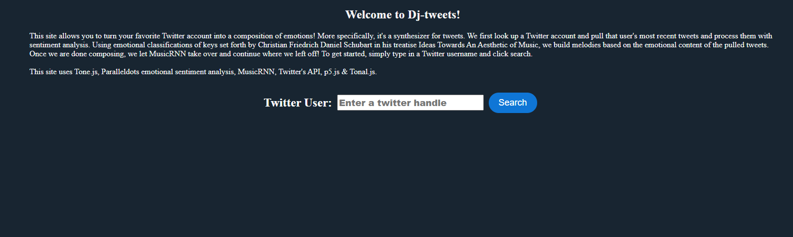
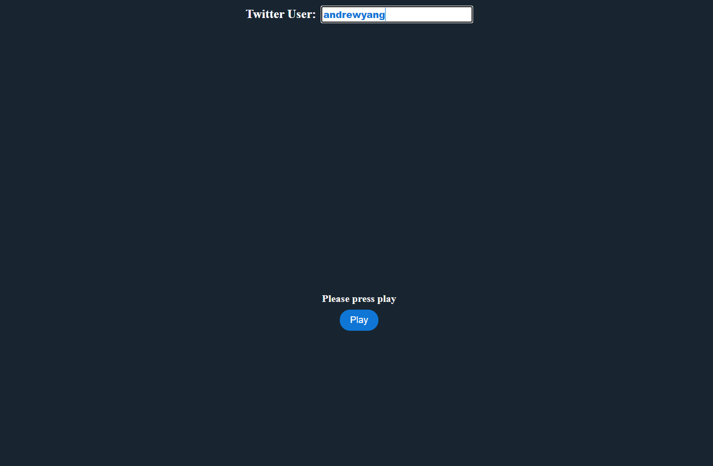

# DJ Tweets

[](https://opensource.org/licenses/Apache-2.0)

## About 

With DJ Tweets, you can put a Twitter user's tweets to music and watch the melody unfold on your screen as you listen.

## How It Works

Simply type in a Twitter username and click search. If a Twitter user with that username is found, the ten most recent tweets are pulled and passed through a sentiment analysis API. Using the emotions returned from the API, short melodies are derived that reflect these emotions through the use of note length and scale degree options. Once we have our short melodies, we pass them to Music_RNN to create a logical continuation of our melody with the most prevalent emotion determining options such as the overall key of the piece and how close to the original our continuation will be. Once the continuation process has been completed, the new melody is joined with our original melodies. It is then loaded into a music player and a visualizer, so you can watch the notes pass as you hear the song of tweets! 

Can't think of a Twitter user? Try andrewyang, kimkardashian, or ~~realdonaldtrump~~!

## Tech Stack Used

* Magenta.js
* Music_RNN
* Tone.js
* Tonal.js
* p5.js
* Twitter API
* ParallelDots Sentiment Analysis API
* Node.js
* Express.js

## Installation

* Apply for API keys from ParallelDots and Twitter
* Insert API keys into indicated variables
* Clone repository and run npm install
* Run ```npm start``` to start your server 😊


Landing page


Player ready!


Display while piece is playing